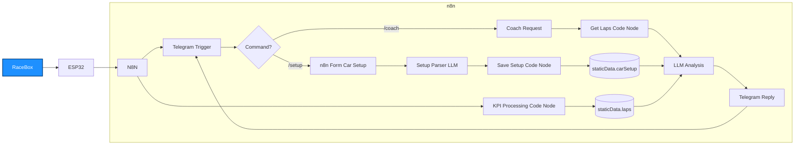

# 🏎️ AI Race Engineer — Real-Time Track Coaching  
**RaceBox Mini S + ESP32 + n8n + LLM + Telegram**

This project transforms a RaceBox Mini S and an ESP32 into a **real-time AI race engineer**.  
It provides on-the-fly lap analysis, driving feedback, and car setup recommendations via Telegram using an n8n workflow and an LLM.

---

## ⭐ Features

### 🚗 Real-Time Lap Telemetry
- ESP32 connects to RaceBox Mini S via BLE  
- Telemetry and lap triggers sent to n8n  
- n8n computes sector KPIs, theoretical laps, and issue tags  

### 🧠 AI-Powered Driving Coach
- Telegram `/coach` command triggers the LLM  
- LLM receives:
  - Recent laps  
  - Theoretical vs actual lap time  
  - Sector performance  
  - Worst sector analysis  
  - Issue tags (low min speed, brake entry, etc.)  
  - Full car setup  
- Returns concise, actionable feedback

### 🔧 Car Setup Storage
Two storage methods supported:
1. Telegram-based `/setup` form  
2. (Optional) Google Sheets backend  

Stored fields include:
- Car name, engine, weight  
- Suspension details  
- Tyres, size, age  
- Cold/hot pressures  
- Aero setup (wing angle)  
- ECU map settings  
- Additional notes  

### 📱 Telegram User Interface
- `/setup` → update and confirm car setup  
- `/coach` → receive AI analysis of lap data  
- Beautiful formatted messages  
- Multi-user support via chatId isolation  

### 🧩 Extensible Design
- Add track maps  
- Add speed trace analysis  
- Add predictive delta & real-time ghosting  
- Store laps in DB instead of static memory  
- Multi-car, multi-track profiles

---

## 🏗️ System Architecture


---

## ⚙️ How It Works

### 1. Telemetry Ingestion  
ESP32 sends JSON to n8n:

```json
{
  "track": "Serres",
  "car": "GT86",
  "lap": 12,
  "lap_time_s": 85.64,
  "theoretical_s": 84.98,
  "sectors": [
    { "id": "T3", "t_s": 18.42, "min_kmh": 52 }
  ],
  "env": { "temp_c": 26, "dry": true }
}
```

### 2. KPI Processing  
n8n computes:
- Gap to theoretical  
- Sector deltas  
- Worst sector  
- Issue tags  
- Conditions (ambient temp, dry/wet)  

Stored under:

```
staticData.laps[chatId]
```

### 3. Car Setup Storage  
Via Telegram form → LLM parser → normalized JSON:

```json
{
  "car_name": "bmw e46",
  "engine": "n54b30a",
  "weight_kg": 1400,
  "coilover": "kw variant 3",
  "tyre_model": "ar1",
  "pressures_cold_bar": { "fl": 2, "fr": 2, "rl": 1.5, "rr": 1.5 },
  "wing_deg": 30,
  "notes": "mhd ots map, front diffuser"
}
```

Stored under:

```
staticData.carSetup[chatId]
```

### 4. AI Coaching  
On `/coach`:

- n8n gathers:
  - recent laps  
  - latest lap  
  - car setup  
- Sends everything to the LLM  

Example AI output:

```
📝 You are losing ~0.6s in T3 due to low minimum speed (52 km/h).
Try braking later and releasing the brake earlier to carry momentum.

Setup suggestion:
Front AR-1 cold pressures at 2.0 seem slightly high for 26°C. Try 1.9 next run.

Remember: Smooth turn-in for T3!
```

---

## 📂 Project Structure

```
/esp32/
   └─ RaceBox BLE client → HTTP sender

/n8n/
   ├─ racebox_webhook.json
   ├─ kpi_processing.json
   ├─ setup_parser.json
   ├─ save_setup.json
   ├─ coach_analysis.json
   ├─ telegram_nodes.json
   └─ helpers/

README.md
```

---

## 🛠️ Requirements

- ESP32 (ESP32-D / WROOM)
- RaceBox Mini S
- n8n (self-hosted or cloud)
- OpenAI API key or local LLM (LM Studio)
- Telegram Bot API token
- WiFi hotspot inside the car (phone)

---

## 🚀 Setup Guide

### 1. Flash ESP32  
- Configure WiFi  
- Set BLE RaceBox address  
- Set n8n webhook URL  
- Upload code with Arduino IDE or PlatformIO  

### 2. Create Telegram Bot  
- Use **BotFather**  
- Add token to n8n  

### 3. Import n8n Workflows  
- Webhook  
- KPI parser  
- Setup parser  
- Save setup  
- Coach analysis  
- Telegram reply system  

### 4. Run Track Session  
- Set car setup with `/setup`  
- Drive laps (ESP32 auto-sends telemetry)  
- After a stint → `/coach` → receive AI feedback  

---

## 📈 Future Improvements

- GPS trace analysis  
- Speed vs distance graphing  
- Real-time delta comparison  
- Google Sheets setup backend  
- Multi-car / multi-track setup profiles  
- Live “engineer mode” analysis from pit lane  
- CAN/OBD2 integration via ESP32  

---

## 🤝 Contributing

PRs welcome!  
Ideas include:
- RaceBox Micro WiFi support  
- Better BLE parsers  
- Track map libraries  
- Advanced AI coaching prompts  

---

## 📜 License
This project is available under a **dual-license model**:

### 🟢 Open Source License (AGPLv3)
The core project is licensed under the **GNU Affero General Public License v3.0 (AGPLv3)**.

You are free to:
- Use the software
- Modify the software
- Distribute it
- Deploy it in your own open-source or internal projects

However, the AGPLv3 requires that **if you run a modified version of this project as a network service (such as a SaaS or public API), you must also release the full source code of your modified version under the AGPLv3.**

This ensures that improvements remain open and benefit the community.

### 🔵 Commercial License (Proprietary)
If you wish to:
- Use this project in a **closed-source** product,
- Integrate it into a **commercial** or **proprietary** platform,
- Offer it as a **SaaS** or part of a commercial service **without releasing your own source code**,  
- Or otherwise avoid the obligations of the AGPLv3,

a **commercial license** is available.

Commercial licenses grant you:
- The right to use this project in proprietary software
- The right to keep your modifications closed-source
- The ability to create commercial SaaS offerings without AGPL obligations
- Optional priority support or partnership terms (if applicable)

To obtain a commercial license or request more information, please contact:

**Greg Papaspyropoulos**  
📧 greg@raiseperform.gr
📧 greg.papaspiropoulos@gmail.com

[](LICENSE)
[](LICENSE-COMMERCIAL)